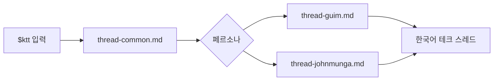

<p align="center">
  
</p>

<p align="center">
  
</p>

<p align="center">
  
</p>

<p align="center">
  <a href="#빠른-사용"></a>
  <a href="#페르소나"></a>
  <a href="#자세한-설명"></a>
</p>

Korean Tech Threader는 URL, 메모, 초안, 아이디어를 짧고 강한 한국어 테크 스레드로 바꾸는 스킬입니다.

말은 가볍게.  
내용은 얕지 않게.  
끝은 저장하고 싶게.

## 설치 방법

Codex, Claude Code에서 아래와 같이 입력합니다.

> [dextune/korean-tech-threader](https://github.com/dextune/korean-tech-threader) 스킬을 설치하세요.

프로젝트 안에서만 쓰려면 아래 위치에 둡니다.

```text
.agents/skills/ktt
.claude/skills/ktt
```

스킬이 보이지 않으면 Codex 또는 Claude Code를 다시 시작합니다.

## 빠른 사용

```text
$ktt 페르소나명 URL 또는 내용
```

```text
$ktt 존문가 https://example.com/article-about-ai-tools
```

```text
$ktt 거임
배포 자동화는 버튼보다 실패 복구 설계가 더 중요하다.
```

페르소나를 생략하면 `거임`으로 작성합니다.

```text
$ktt
AI 검색에서 중요한 건 점수보다 결과를 추적할 수 있는 구조다.
```

## 페르소나

| 페르소나 | 이런 글에 좋음 |
|---|---|
| `거임` | 운영, 비용, 장애, 실패 복구, 유지보수 |
| `존문가` | 도구 조합, 자동화, 빠른 실험, 비용 절감 |

목록 보기:

```text
ktt 목록
```

<br>
<br>

---

<br>
<br>

## 자세한 설명

### 무엇을 해주나

긴 원문을 그대로 요약하지 않습니다.  
하나의 중심 주장으로 압축하고, 모바일에서 읽기 쉬운 스레드 흐름으로 다시 씁니다.

주로 다룹니다:

- AI
- 개발
- 인프라
- 자동화
- 스타트업
- 생산성

### 작성 원칙

| 원칙 | 설명 |
|---|---|
| 짧게 | 한 줄을 길게 끌지 않습니다. |
| 하나만 | 한 스레드에는 중심 주장을 하나만 둡니다. |
| 꺾기 | 중간에 관점 전환이나 반전을 넣습니다. |
| 검증 | 확인되지 않은 수치나 이름은 단정하지 않습니다. |
| 페르소나 | 말투와 관점은 선택한 페르소나를 따릅니다. |

### 모듈 구조

```text
.
|-- SKILL.md
|-- assets/
|   |-- ktt-readme.jpg
|   |-- ktt-title.svg
|   `-- ktt.png
|-- references/
|   |-- thread-common.md
|   |-- thread-guim.md
|   `-- thread-johnmunga.md
`-- README.md
```



| 모듈 | 역할 |
|---|---|
| `thread-common.md` | 스레드 구조, 줄바꿈, 훅, 반전, 사실 검증 |
| `thread-guim.md` | `거임` 말투 |
| `thread-johnmunga.md` | `존문가` 말투 |

새 페르소나는 영어 파일명으로 추가합니다.

```text
references/thread-module-name.md
```

사용자가 입력하는 페르소나명은 한글이어도 됩니다.

### 말투 예시

`거임`

AI 기능 붙일 때 다들 모델부터 봄.  
근데 진짜 문제는 그 다음임.  
로그, 권한, 실패 복구가 없으면 운영에서 바로 터짐.  
결국 중요한 건 똑똑한 답변이 아니라 망가졌을 때 돌아오는 구조임.

`존문가`

회의록 자동화는 거창한 SaaS부터 볼 필요 없다.  
캘린더에 녹취 파일 붙이고 요약 스크립트 하나 돌리면 된다.  
결과를 마크다운으로 남기면 검색도 백업도 끝.  
핵심은 도구가 아니라 흐름을 작게 고정하는 거다.

## 라이선스

배포 전에 원하는 라이선스를 추가하세요.
