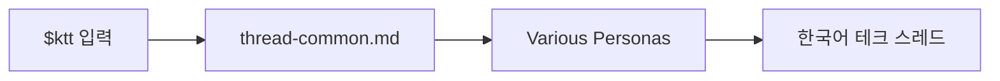

<p align="center">
  
</p>

<p align="center">
  
</p>

<p align="center">
  
</p>

<p align="center">
  <a href="#빠른-사용"></a>
  <a href="#페르소나-목록"></a>
  <a href="#자세한-설명"></a>
</p>

Korean Tech Threader는 URL, 메모, 초안, 아이디어를 짧고 강한 한국어 테크 스레드로 바꾸는 스킬입니다.

말은 가볍게.  
내용은 얕지 않게.  
끝은 저장하고 싶게.

## 설치 방법

Codex, Claude Code에서 아래와 같이 입력합니다.

> https://github.com/dextune/korean-tech-threader 스킬을 설치하세요.

프로젝트 안에서만 쓰려면 아래 위치에 둡니다.

```text
.agents/skills/ktt
.claude/skills/ktt
```

스킬이 보이지 않으면 Codex 또는 Claude Code를 다시 시작합니다.

## 빠른 사용

```text
$ktt 페르소나명 URL 또는 내용
```

```text
$ktt 존문가 https://example.com/article-about-ai-tools
```

```text
$ktt 거임
배포 자동화는 버튼보다 실패 복구 설계가 더 중요하다.
```

페르소나를 생략하면 `거임`으로 작성합니다.

```text
$ktt
AI 검색에서 중요한 건 점수보다 결과를 추적할 수 있는 구조다.
```

## 페르소나 목록

```text
$ktt 목록
```

## 페르소나 생성

참고할 텍스트나 이미지를 바탕으로 새 페르소나 모듈을 만들 수 있습니다.

```text
$ktt 생성 [페르소나명]
참고할 텍스트 또는 이미지
```

`페르소나명`은 선택값입니다.
이름을 함께 입력하면 그 한글명을 우선 검토하고,
생략하면 참고 자료를 분석해 어울리는 한글 1단어 이름을 정합니다.

이 명령은 `MAKE.md`의 규칙을 따라 말투를 분석하고,
새 `references/thread-<module-name>.md` 파일과 스킬 매핑을 갱신합니다.


<br>

---

<br>

## 자세한 설명

### 무엇을 해주나

긴 원문을 그대로 요약하지 않습니다.  
선택한 페르소나의 관점, 말투, 구조로 다시 씁니다.

### 작성 원칙

| 원칙 | 설명 |
|---|---|
| 모듈 | 공통 파일은 입력, 정보 수집, 교차 검증, 원문 보호를 맡습니다. |
| 검증 | 정보성 글은 공식 또는 신뢰 가능한 출처를 확인하고 교차 검증합니다. |
| 원문 보호 | 제공된 문장이나 고유 표현을 그대로 재사용하지 않습니다. |
| 페르소나 | 말투, 줄바꿈, 구조, 결론 방식은 선택한 페르소나를 따릅니다. |

### 모듈 구조

```text
.
|-- AGENTS.md
|-- SKILL.md
|-- MAKE.md
|-- assets/
|   |-- ktt-readme.jpg
|   |-- ktt-title.svg
|   `-- ktt.png
|-- references/
|   |-- thread-common.md
|   |-- thread-chingeun-banmal.md
|   |-- thread-guim.md
|   |-- thread-johnmunga.md
|   |-- thread-segfault.md
|   `-- thread-trust.md
`-- README.md
```



KTT는 공통 시스템과 페르소나 모듈을 분리합니다.

`thread-common.md`는 입력 해석, 페르소나 선택, 정보 수집, 교차 검증, 원문 보호처럼 모든 페르소나에 공통으로 필요한 운영 규칙만 담당합니다.
각 `thread-<module-name>.md` 파일은 말투, 줄바꿈, 전개 구조, 강조 지점, 결론 방식처럼 공통화하면 안 되는 문체 규칙을 독립적으로 정의합니다.

그래서 새 페르소나가 늘어나도 공통 파일을 비대하게 만들지 않습니다.
새 말투는 새 모듈로 추가하고, `SKILL.md`의 한글 호출명과 파일명 매핑만 갱신합니다.

| 모듈 | 역할 |
|---|---|
| `thread-common.md` | 모듈 로드, 입력 해석, 정보 수집, 교차 검증, 원문 보호 |
| `thread-chingeun-banmal.md` | `친근반말` 말투 |
| `thread-guim.md` | `거임` 말투 |
| `thread-johnmunga.md` | `존문가` 말투 |
| `thread-segfault.md` | `세그폴트` 말투 |
| `thread-trust.md` | `신뢰` 말투 |

새 페르소나의 호출명은 한글 1단어로 정합니다.

페르소나 파일명은 영어 단어 또는 한글 발음 로마자로 추가합니다.

```text
references/thread-module-name.md
```

사용자는 한글 페르소나명으로 호출하고,
스킬은 해당 이름을 `references/thread-<module-name>.md` 파일에 매핑합니다.

### 말투 예시

`거임`

AI 기능 붙일 때 다들 모델부터 봄.  
근데 진짜 문제는 그 다음임.  
로그, 권한, 실패 복구가 없으면 운영에서 바로 터짐.  
결국 중요한 건 똑똑한 답변이 아니라 망가졌을 때 돌아오는 구조임.

`존문가`

회의록 자동화는 거창한 SaaS부터 볼 필요 없다.  
캘린더에 녹취 파일 붙이고 요약 스크립트 하나 돌리면 된다.  
결과를 마크다운으로 남기면 검색도 백업도 끝.  
핵심은 도구가 아니라 흐름을 작게 고정하는 거다.

`세그폴트`

프론트엔드 빌드의 무거운 레이어가 조금씩 아래로 내려가고 있습니다.
겉에서는 설정이 줄어든 것처럼 보이지만, 밑에서는 파서와 번들러, 런타임 경계가 다시 정리되고 있습니다.
핵심은 빠르다는 감상이 아니라, 생태계가 같은 방향으로 수렴하고 있다는 점입니다.

`친근반말`

개발 도구 쪽에도 조용히 변화가 생기고 있어.
겉으로는 작은 업데이트처럼 보여도, 작업 흐름이 짧아지면 개발자 체감은 꽤 크지.
지금 흐름만 보면 도구 경쟁이 기능 목록보다 피드백 속도 쪽으로 옮겨가는 느낌이야.

`신뢰`

배포 설정의 기본 캐시 정책이 바뀌면서 새 프로젝트에는 정적 자산 캐시가 자동 적용됩니다.
기존 프로젝트는 설정 파일을 갱신해야 같은 동작을 사용할 수 있으며, 캐시 기간은 배포 환경에 따라 달라질 수 있습니다.
현재 확인된 의미는 설정 부담이 줄고 작은 프로젝트의 기본 성능 기준이 올라간다는 점입니다.

## 라이선스

배포 전에 원하는 라이선스를 추가하세요.
